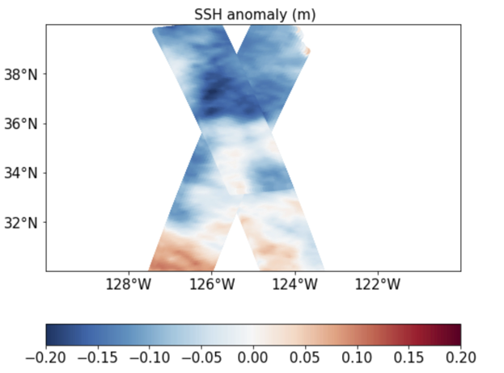
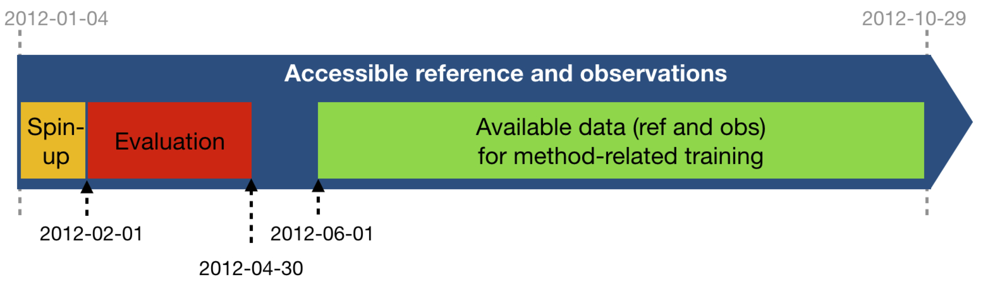

 
# 2023b High frequency SSH mapping data challenge 

 

[](https://zenodo.org/badge/latestdoi/455492729)


This repository contains codes and sample notebooks of a data challenge for downloading and processing the high frequency SSH mapping with artificial SWOT and artificial conventional nadirs data in the Californian SWOT X-over.
 

<p float="left">
  
  
</p>

## Motivation

The goal is to investigate how to best reconstruct sequences of Sea Surface Height (SSH) maps and separate the balanced motions and the internal waves in the Californian SWOT cross-over from artificial SWOT satellite and conventional nadir altimetry observations. This data challenge follows an _Observation System Simulation Experiment_ framework: "reference" full SSH are from a numerical simulation with a realistic, high-resolution ocean circulation model: the reference simulation. Satellite observations are simulated by sampling the reference simulation based on realistic orbits of past, existing or future altimetry satellites. A baseline reconstruction method is provided (see below) and the practical goal of the challenge is to beat this baseline according to scores also described below and in Jupyter notebooks.

### Reference simulation
The reference simulation is the MITgcm LLC4320 simulation. The simulation is run with tidal forcing. The SSH maps are available hourly. The barotropic tide and the dac have been removed from the reference run. Also, the balanced motions and the internal waves have been seperated using spatio-temporal filters

### Observations
The SSH observations are SWOT and conventional nadirs altimeter data simulated on the reference run. Hence, the barotropic tide is also not present in the SWOT observations. 


Three mapping experiments can be performed using SWOT: 
- without observation errors: **SWOT no noise** ('ssh_model' variable), 
- with KaRIn errors only: **SWOT KaRIn noise** ('ssh_karin' variable),
- with all observation errors: **SWOT all noise** ('ssh_obs' variable).

As an illustration, see the [`demo_perform_oi`](https://github.com/SammyMetref/2022a_mapping_HFdynamic/blob/master/notebooks/demo_perform_oi.ipynb) notebook that performs an OI reconstruction in these three experiments. 

### Data sequence and use
 
The SSH reconstructions are assessed over the period from 2012-02-01 to 2012-04-30: 89 days.
For reconstruction methods that need a spin-up, the **observations** can be used from 2012-01-04 until the beginning of the evaluation period. This spin-up period is not included in the evaluation. For reconstruction methods that need learning from full fields, the **reference data** and the **observations** can be used from 2012-06-01 to 2012-10-29. The reference data between 2012-05-01 and 2012-05-31 should never be used so that any learning period or other method-related-training period can be considered uncorrelated to the evaluation period.



### Evalutation

The metrics used to evaluate the mapping and separation are: 

## Leaderboard

**SWOT no noise** 

| Method     |   µ(RMSE) |   σ(RMSE) |   λx (degree) |   λt (days) | Notes                     | Reference        
|:-----------|:------------------------:|:---------------------:|:-------------------------:|:-----------------------:|:--------------------------|:-----------------
| OI |                    0.85 |                 0.05 |                      1.14 |                  4.38 | Covariances not optimized | demo_perform_oi.ipynb |
| BFN-QG |                    0.9 |                 0.02 |                      1.06 |                  4.12 | Boundary cond. using OI outputs | MASSH package |
<br/>

**SWOT KaRIn noise** 

| Method     |   µ(RMSE) |   σ(RMSE) |   λx (degree) |   λt (days) | Notes                     | Reference        
|:-----------|:------------------------:|:---------------------:|:-------------------------:|:-----------------------:|:--------------------------|:-----------------
| OI |                    0.85 |                 0.05 |                     1.15 |                  4.42 | Covariances not optimized | demo_perform_oi.ipynb |
| BFN-QG |                   0.89 |                 0.02 |                      1.07 |                  4.18 | Boundary cond. using OI outputs | MASSH package |
<br/>

**SWOT all noise** 

| Method     |   µ(RMSE) |   σ(RMSE) |   λx (degree) |   λt (days) | Notes                     | Reference        
|:-----------|:------------------------:|:---------------------:|:-------------------------:|:-----------------------:|:--------------------------|:-----------------
| OI |                    0.83 |                 0.05 |                     1.86 |                  4.53 | Covariances not optimized | demo_perform_oi.ipynb | 
| BFN-QG |                   0.87 |                 0.03 |                      1.87 |                  4.22 | Boundary cond. using OI outputs | MASSH package |


**µ(RMSE)**: average RMSE score.  
**σ(RMSE)**: standard deviation of the RMSE score.  
**λx**: minimum spatial scale resolved.  
**λt**: minimum time scale resolved. 
  

## The data

### Data structure

 The data are available [here](https://ige-meom-opendap.univ-grenoble-alpes.fr/thredds/catalog/meomopendap/extract/MEOM/OCEAN_DATA_CHALLENGES/2023b_SSHmapping_HF_California/catalog.html). They are presented with the following directory structure:

- dc_obs_swot/: SWOT data, observations from SWOTsimulator on MITgcm reference;

```
.
|-- dc_obs_swot
|   |--    SSH_SWOT_XXXXXX.nc

```
where XXXXX are the dates specifications.

- dc_obs_nadirs/: conventional nadirs data, observations from SWOTsimulator on MITgcm reference;

```
.
|-- dc_obs_nadirs/*/
|   |-- SSH_NADIR_XXXXX.nc

```
where * can be one of the available satellites: swot/ (which is the swot nadir), alg/, c2/, j3/, s3a/ and s3b/ ; and XXXXX dates specifications.


- dc_ref_eval: evaluation data, SSH reference from MITgcm during the evaluation period;

```
|-- dc_ref_eval
|   |-- 2023b_SSHmapping_HF_California_eval_****-**-**.nc

where ****-**-** stands for year, month and day. 
```

<!--
- dc_mod: training/validation data, SSH MITgcm outside of the evaluation period.
  
```
|-- dc_mod
|   |-- 2022a_SSH_mapping_CalXover_model_****-**-**.nc

where ****-**-** stands for year, month and day. 

```
-->

### Download the data


To start out download the *observation* dataset (dc_obs) from the temporary data server, use:
```shell
wget https://ige-meom-opendap.univ-grenoble-alpes.fr/thredds/fileServer/meomopendap/extract/MEOM/OCEAN_DATA_CHALLENGES/2023b_SSHmapping_HF_California/dc_obs_swot.tar.gz
```
and
```shell
wget https://ige-meom-opendap.univ-grenoble-alpes.fr/thredds/fileServer/meomopendap/extract/MEOM/OCEAN_DATA_CHALLENGES/2023b_SSHmapping_HF_California/dc_obs_nadirs.tar.gz
```

the *reference* dataset for the evaluation (dc_ref_eval) using (*this step may take several minutes*):

```shell
wget https://ige-meom-opendap.univ-grenoble-alpes.fr/thredds/fileServer/meomopendap/extract/MEOM/OCEAN_DATA_CHALLENGES/2023b_SSHmapping_HF_California/dc_ref_eval.tar.gz
```
<!--
the *model* dataset for training/validation (dc_ref_eval) using (*this step may take several minutes*):

```shell
wget https://ige-meom-opendap.univ-grenoble-alpes.fr/thredds/fileServer/meomopendap/extract/MEOM/OCEAN_DATA_CHALLENGES/2023b_SSHmapping_HF_California/dc_mod.tar.gz
```
-->

and then uncompress the files using `tar -xvf <file>.tar.gz`. You may also use `ftp`, `rsync` or `curl`to donwload the data.


## Demo for baseline and evaluation

### Baseline
The baseline mapping method is optimal interpolation (OI), in the spirit of the present-day standard for DUACS products provided by AVISO. OI is implemented in the [`demo_perform_oi`](https://github.com/SammyMetref/2022a_mapping_HFdynamic/blob/master/notebooks/demo_perform_oi.ipynb) Jupyter notebook. The SSH reconstructions are saved as a NetCDF file in the `results` directory. The content of this directory is git-ignored.
   
### Evaluation

The evaluation of the mapping methods is based on the comparison of the SSH reconstructions with the *reference* dataset. It includes two scores, one based on the Root-Mean-Square Error (RMSE), the other based on Fourier wavenumber spectra. The evaluation notebook [`demo_perform_evaluation`](https://github.com/SammyMetref/2022a_mapping_HFdynamic/blob/master/notebooks/demo_perform_evaluation.ipynb) implements the computation of these two scores as they could appear in the leaderboard. The notebook also provides additional, graphical diagnostics based on RMSE and spectra.

## Data processing

Cross-functional modules are gathered in the `src` directory. They include tools for regridding, plots, evaluation, writing and reading NetCDF files. The directory also contains a module that implements the baseline method.  

## Acknowledgement

The structure of this data challenge was to a large extent inspired by [ocean data challenge (2020a)](https://github.com/ocean-data-challenges/2020a_SSH_mapping_NATL60).
